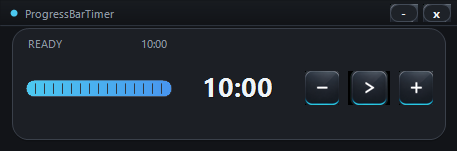
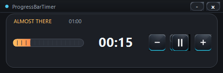
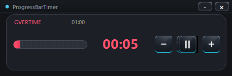

# ProgressBarTimer



## Screenshots / スクリーンショット

| Ready / 通常 | Warning / 警告 | Overtime / 時間超過 |
|------|------|------|
|  |  |  |

## 日本語

Windows 向けのシンプルなカウントダウンタイマーです。常に手前に表示される小さなウィンドウで、残り時間をバーと数字で確認できます。

### 特徴

- デフォルトは 10 分
- カスタムタイトルバー付きのコンパクトなダーク UI
- 画像生成したボタンアセットを使った操作ボタン
- 残り 30% で警告色に変化
- 時間切れ後はオーバータイムとして赤いバーが左から伸びる
- 設定ファイルを作らないため、デスクトップに置いても余計なファイルが増えません

### 操作

| 操作 | 内容 |
|------|------|
| `Space` / `Enter` | スタート / 一時停止 |
| `R` | リセット |
| `Up` / `Down` | 設定時間を 1 分ずつ増減 |
| `-` / `+` ボタン | 設定時間を 1 分ずつ増減。長押しで連続変更 |
| 再生 / 一時停止ボタン | スタート / 一時停止 |
| 数字キー 1-2 桁 | 分数を直接入力。例: `1`, `5` で 15 分 |
| 上部バーをドラッグ | ウィンドウ移動 |
| ウィンドウ端をドラッグ | サイズ変更 |

### ビルド

Windows で `build.bat` を実行します。

```bat
build.bat
```

`.NET SDK 6+` がある場合は、自己完結型の単一 EXE として `timer.exe` を生成します。`.NET SDK` が無い場合は、Windows 標準の .NET Framework コンパイラでビルドを試みます。

### 配布

`build.bat` で生成した `timer.exe` は、基本的に EXE 単体で他の Windows PC に渡して動かせます。

- `.NET SDK 6+` でビルドされた場合: 自己完結型なので .NET の追加インストールなしで動作します。
- `.NET Framework` の `csc.exe` でビルドされた場合: Windows 10/11 に標準搭載されている .NET Framework 上で動作します。
- アプリアイコンとボタン画像は EXE に埋め込まれるため、`assets` フォルダを同梱しなくても表示されます。
- `timer_config.ini` は作成されません。毎回 10 分のデフォルト状態で起動します。

配布時は `timer.exe` だけで十分です。

## English

ProgressBarTimer is a small countdown timer for Windows. It stays on top and shows the remaining time with both a progress bar and a large numeric display.

### Features

- 10-minute default timer
- Compact dark UI with a custom title bar
- Generated raster button assets for a more polished look
- Warning color when 30% or less remains
- Overtime mode after the countdown ends, with a red bar growing from the left
- No settings file is created, so the desktop stays clean when the app is placed there

### Controls

| Control | Action |
|------|------|
| `Space` / `Enter` | Start / pause |
| `R` | Reset |
| `Up` / `Down` | Increase or decrease the timer by 1 minute |
| `-` / `+` buttons | Increase or decrease the timer by 1 minute. Hold to repeat |
| Play / pause button | Start / pause |
| Number keys, 1-2 digits | Enter minutes directly. Example: `1`, `5` means 15 minutes |
| Drag the top bar | Move the window |
| Drag a window edge | Resize the window |

### Build

Run `build.bat` on Windows.

```bat
build.bat
```

If `.NET SDK 6+` is installed, the script builds `timer.exe` as a self-contained single-file executable. If the SDK is not available, it falls back to the .NET Framework compiler included with Windows.

### Distribution

The `timer.exe` generated by `build.bat` can usually be shared as a single file with other Windows PCs.

- Built with `.NET SDK 6+`: self-contained, no extra .NET installation required.
- Built with `.NET Framework csc.exe`: runs on the .NET Framework included with Windows 10/11.
- The app icon and button images are embedded into the EXE, so the `assets` folder is not required at runtime.
- `timer_config.ini` is not created. The app always starts from the 10-minute default.

For normal distribution, `timer.exe` is enough.

## Files

```text
timer.cs                         C# source code
timer.csproj                     .NET project file
build.bat                        Windows build script
timer.exe                        Built executable, ignored by Git
assets/app-icon.png              Source app icon image
assets/app-icon.ico              Windows app icon embedded in the EXE
assets/screenshot.png            README screenshot
assets/screenshot-warning.png    Warning-state README screenshot
assets/screenshot-overtime.png   Overtime-state README screenshot
assets/buttons/btn_minus.png     Button image
assets/buttons/btn_play.png      Button image
assets/buttons/btn_pause.png     Button image
assets/buttons/btn_plus.png      Button image
```
